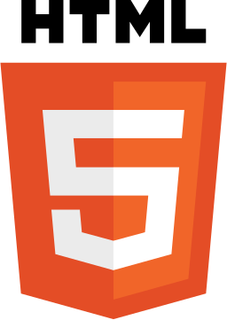

# About Me

Tech stack I love using.

- (4+ using Ruby and Ruby on Rails), (2+ using NodeJS, ExpressJS, FastifyJS, FoalTS...), experience in building RESTful API and GraphQL API, PostgreSQL, MySQL, MariaDB, CockroachDB, MongoDB for data store.
- little knowledge with Python, Django and Flask. 
- little knowledge with Elixir programming language and Phoenix framework.
- little knowledge in Front-end (VueJS).
- deploy to cloud (Heroku and other PaaS provider).

Now I'm focused on using JavaScript everywhere.

Favorite hobby : learn new thing about coding, best practice, experiment thing using my preferred programming languages.

Let me know if you need any help or collaboration on web projects using any of these technologies.

## Skills.

#### Back-end.

  
  
  
  
    
  
  
  <!--
  -->
  
  
  

#### Front-end.

  
  
  
  
  
  

## Recent Projects

#### An real estate application

  UI: https://cifoncia.vercel.app/
   
  API: https://cifoncia-api.herokuapp.com/
  
  UI is build with VueJS and Quasar framework.
   
  API is an GraphQL API build with ExpressJS, Express-graphql, Graphql-tools and Prisma ORM.

<!-- 
## My GitHub Stats

 

 -->

<!-- ## Tech Stacks
- MEEN Stack
- MERN Stack
- JAM Stack
- MRF Stack
 -->

<!--
---
<small> _I am a lifelong learner and I love teaching and inspiring people_. </small>
-->

<!--
### Hi there 👋

I am Francel AMAMOO. I am a Ruby On Rails back-end developer.
Ruby is the language that makes me more productive and is my primary backend programming language. I write very often Ruby and JavaScript code. I also have little front-end skills in JavaScript and Vuejs and little skills in Nodejs.
I am currently more learnning JavaScript, TypeScript and Nodejs and i'm looking for new opportunities.
  

**francelwebdev/francelwebdev** is a ✨ _special_ ✨ repository because its `README.md` (this file) appears on your GitHub profile.

Here are some ideas to get you started:

- 🔭 I’m currently working on ...
- 🌱 I’m currently learning ...
- 👯 I’m looking to collaborate on ...
- 🤔 I’m looking for help with ...
- 💬 Ask me about ...
- 📫 How to reach me: ...
- 😄 Pronouns: ...
- ⚡ Fun fact: ...
-->
